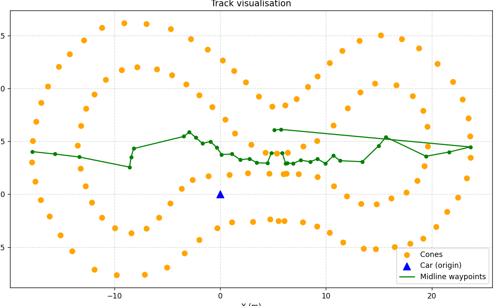
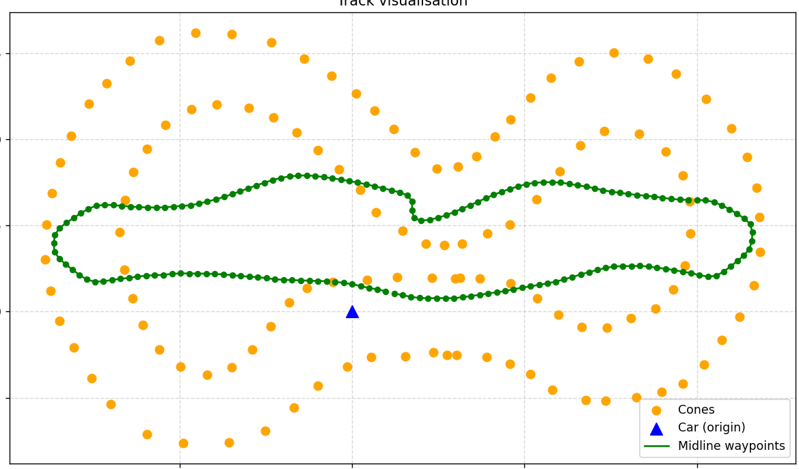
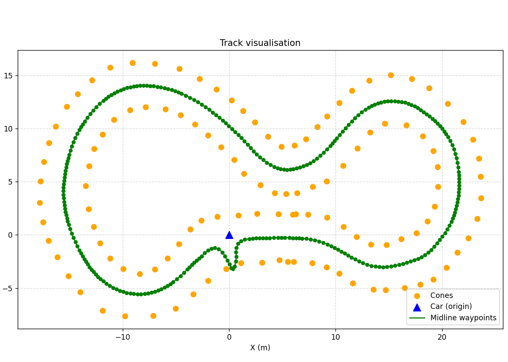
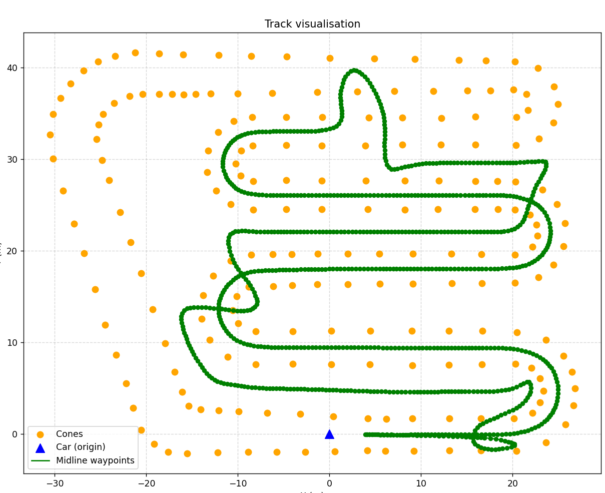

# Q3 Waypoint Generation - Development Notes

## V1 Status (Known Problems)
This is **V1** and the result is currently **terrible / not production-ready**.
I used GitHub Copilot to generate a fast prototype for quick iteration.

Main reasons:
- The code cannot reliably find the car's starting position on the centerline.
- The code can break or produce incorrect waypoint ordering when two track sections are too close together (for example, near parallel segments or overlapping loops in local distance).

These issues are currently unresolved in V1 and should be treated as known limitations.

## V2 Update
- I tried to fix V2 with AI assistance, but it still produces bad results.
- I am still trying to understand the algorithm generated by AI.
- I will look for additional solutions and references on the internet.
- The next iteration (V3) will be based on that research and a cleaner algorithm redesign.

## V3 Update
The Delaunay-based rewrite is currently worse than V2 in path quality.
The generated centerline is sparse and often follows the wrong route in tight/parallel sections.

I will iterate again with a new ordering/filtering strategy and compare output quality after each change.

## V4 Update
In V4, the waypoints became more rounded after I split cones into two boundaries, aligned the two boundary loops, generated midpoint pairs, and applied spline-like Laplacian smoothing before final resampling (`<= 0.5 m` spacing).

## V5 Update
The result is getting better on track 1 and 2 but still worse on track 3.

### What changed in `Question-3.cc` (V5)
- Replaced free midpoint ordering with a **Delaunay-topology graph**:
  - Build Delaunay triangles from unordered cones.
  - Convert triangle edges with plausible width (`2.5 m` to `9.0 m`) into midpoint nodes.
  - Connect midpoint nodes only when their source edges belong to the same triangle.
- Reworked ordering into a **graph walk** (`walkGraph`) instead of plain nearest-neighbor sorting:
  - Start from node nearest to origin.
  - Use heading-biased neighbor scoring to reduce abrupt zig-zags.
  - Bridge short gaps (`<= 5.0 m`) to recover disconnected local components.
- Added a two-stage smoothing/interpolation pipeline:
  - Laplacian smoothing on ordered raw nodes.
  - Catmull-Rom closed-loop interpolation.
  - Final light smoothing pass after interpolation.
- Kept waypoint spacing under requirement using spline step target `0.45 m` (constraint is `<= 0.5 m`).

### Why track 3 is still worse
- `track3` has more dense and ambiguous local geometry; width-only edge filtering can still keep wrong cross-track pairs.
- Graph traversal is still heuristic; in complex parallel sections, local best-next selection may choose a suboptimal branch.

Track 1:

Track 3:

## Summary
Implemented `Q3/Question-3.cc` to:
- Read an unordered cone CSV (`x,y`).
- Infer centerline waypoint candidates geometrically.
- Order and smooth the centerline into a closed loop.
- Resample to enforce `<= 0.5 m` spacing.
- Write waypoints to output CSV with the same `x,y` format.

## V5 Technical Notes
V5 became much better after simplifying and tightening the pipeline around Delaunay + graph walk + spline:
- Centerline candidates are generated from Delaunay edge midpoints using width filtering (`2.5 m` to `9.0 m`).
- Midpoint ordering is topology-guided using adjacency derived from shared triangles.
- A heading-biased DFS walk is used to produce a consistent waypoint order.
- Laplacian smoothing + Catmull-Rom interpolation is used to produce rounded waypoints.
- Final spacing remains under `0.5 m` via `0.45 m` interpolation step target.

## Hurdles Encountered

1. `Question-3.cc` started as an empty/stub file
- Hurdle: There was no runnable implementation logic to extend.
- Action: Rebuilt the solution from scratch with full CSV parsing, geometry utilities, candidate generation, ordering, and output.

2. Midline extraction without cone labels (inner vs outer unknown)
- Hurdle: The input is unordered and does not identify boundary membership.
- Action: Used Delaunay triangulation and converted plausible-width triangle edges into midpoint candidates.
- Result: Midline candidates are derived from local geometry rather than requiring explicit inner/outer labels.

3. Large number of noisy/outlier midpoint candidates
- Hurdle: Delaunay edges include both useful cross-track and unhelpful along-track links.
- Action: Applied width filtering and triangle-based adjacency constraints when building the centreline graph.
- Result: Reduced invalid candidates and improved centerline continuity on simpler tracks.

4. Ordering unordered midpoint cloud into a continuous loop
- Hurdle: Midpoints are still unordered; naive nearest-neighbor sorting causes route jumps.
- Action: Replaced ordering with a heading-biased DFS traversal over the centreline graph and short-gap bridging.
- Result: Better sequence quality and fewer obvious tangles on track 1 and track 2.

5. Unstable path quality on complex track (`track3.csv`)
- Hurdle: Parallel/close sections still introduce branch ambiguity in the graph walk.
- Action: Added extra smoothing and conservative interpolation spacing to reduce jagged behavior.
- Result: Improvement exists, but track 3 remains the weakest case.

6. CMake Tools build configuration unavailable in environment
- Hurdle: `Build_CMakeTools` failed with configure error in this VS Code session.
- Action: Verified correctness by compiling `Q3/Question-3.cc` directly with `g++` and running on all supplied tracks.
- Result: End-to-end generation succeeded for all three provided track CSV files.

## Validation Runs Performed
Compiled and ran:
- `Q3/track1.csv -> Q3/waypoints.csv`
- `Q3/track2.csv -> Q3/waypoints2.csv`
- `Q3/track3.csv -> Q3/waypoints3.csv`

Latest run produced:
- `track1`: 293 waypoints
- `track2`: 324 waypoints
- `track3`: 836 waypoints

## Remaining Tradeoffs
- The approach is fully geometric and avoids external libraries, but it is heuristic rather than exact Voronoi/Delaunay centerline extraction.
- On unusually complex or degenerate cone layouts, fallback ordering may still produce suboptimal smoothness compared to full computational-geometry solutions.
